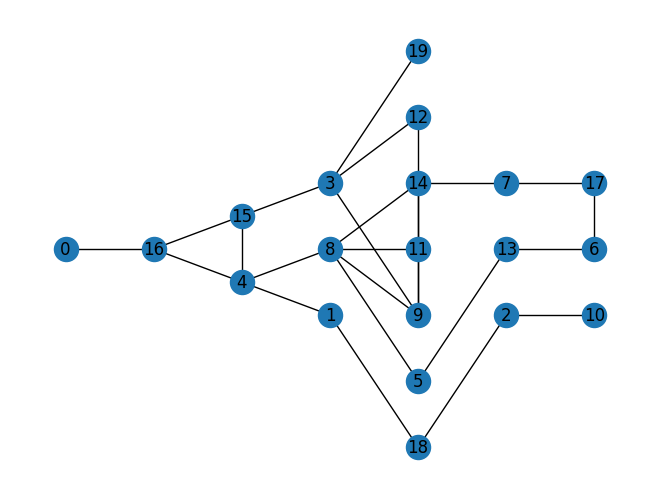
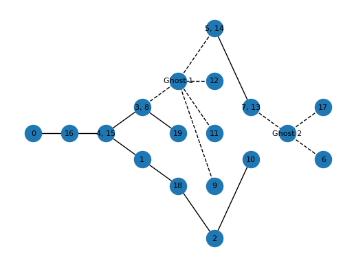
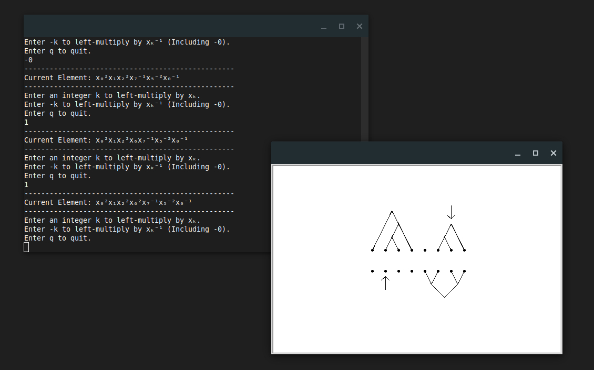

---

## [Gromov's Approximating Tree .ipynb](https://github.com/And-ers/Gromov-Trees)
#### Research Tool / Demonstration

      
      

Included in this repository is a Jupyter Notebook file containing an implementation of the algorithm discussed in [Gromov's Approximating Tree and the All-Pairs Bottleneck Paths Problem](https://arxiv.org/abs/2408.05338#) by Anders Cornect (myself) and Dr. Eduardo Martinez-Pedroza of Memorial University of Newfoundland.

**Current Features:**
- Jupyter Notebook containing code that demonstrates the connection between Gromov's Approximating Tree and the All-Pairs Bottleneck Paths problem, as discussed in the above paper.
- Included is an example of a graph being approximated by this method, with each graph drawn using the NetworkX package for Python.

## [Thompson's Group F Python Package](https://github.com/And-ers/thompsons-group-f)
#### Research Tool

This package implements _Thompson's Group_ \\(F\\), from this point simply referred to as \\(F\\), as a Python class. For the necessary background information, please see José Burillo's _Introduction to Thompson's Group_ \\(F\\), available from his [page on the Universitat Politècnica de Catalunya website](https://web.mat.upc.edu/pep.burillo/book_en.php). This book assumes basic knowledge of group theory and graph theory.

Elements of \\(F\\) are implemented using the following infinite presentation by generators and relations:

   $$F = \left\langle x_0, x_1, x_2, \ldots, x_n, \ldots \mid x_i^{-1}x_jx_i = x_{j+i}, \text{ for } i < j \right\rangle.$$

Each element is represented as a product of the above generators \\(x_i\\). Much of the theory behind certain features, most notably the representation of elements by "forest diagrams", as well as calculating the word length of elements, come from the paper _Forest Diagrams for Elements of Thompson's Group_ \\(F\\) (2005) by James M. Belk and Kenneth S. Brown of Cornell University, available on [arXiv](https://arxiv.org/abs/math/0305412). 

[Documentation](http://exotic-groups.rtfd.io/) is hosted on ReadTheDocs.

**Current Features:**
- Multiplication and division of abstract elements in \\(F\\).
- Finding normal forms of elements.
- Representing elements by forest diagrams (in the form of strings and Python Turtle drawings).
- Calculating the word length of elements in terms of generators \\(x_0\\) and \\(x_1\\).

**Planned Features:**
- Representing of elements as pairs of binary trees.
  
**Requirements:**
- Python 3.10 or newer.

## [ForPeanuts (4PN) Small Inventory Manager](https://github.com/And-ers/4peanuts)
#### Personal Project

ForPeanuts is a small inventory manager, designed with a focus on simplicity and ease of use. This was originally designed for use by vendors at a local farmer's market, but ended up becoming more of a personal coding project. Designed with PyQt6.

**Current Features:**
- Tracking of inventory by item, with categories that can comprise a number of similar items.
- Order and revenue tracking, with built-in profit calculator (i.e., profit after taking production costs into account).
- Built-in sales feature, i.e., automatic tracing & price calculation for BOGO-style and bulk offerings.
- Order logging, allows inventory and sales data to be saved locally for later use.
- Graphing of customer count and profit over time.

